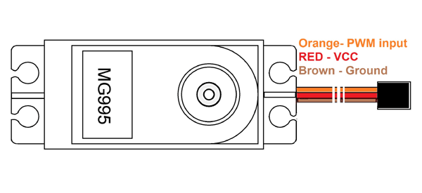

# 6-DOF ESP Arm

This project demonstrates the control of a 6-DOF robotic arm using an ESP32 and MG996R servos, with object detection via a VL53L0X time-of-flight sensor. The arm performs a pick-and-place sequence when an object is detected within a specified range.

---

## Getting Started

### 1. Install the Arduino IDE

Download and install the Arduino IDE from the official website:  
[https://www.arduino.cc/en/software/](https://www.arduino.cc/en/software/)

### 2. Install the ESP32 Board Support

To program the ESP32, you need to add the ESP32 board definitions to the Arduino IDE:

1. Open the Arduino IDE.
2. Go to **File > Preferences**.
3. In the "Additional Boards Manager URLs" field, add:  
   `https://espressif.github.io/arduino-esp32/package_esp32_index.json`
4. Go to **Tools > Board > Boards Manager**.
5. Search for "ESP32" and click **Install** on the "esp32 by Espressif Systems" entry.

### 3. Install Required Libraries


## Libraries Required

To run this project, you need to install the following libraries in your Arduino IDE:

- [ESP32Servo](https://github.com/jkb-git/ESP32Servo): For controlling servo motors with the ESP32.
- [Adafruit_VL53L0X](https://github.com/adafruit/Adafruit_VL53L0X): For interfacing with the VL53L0X time-of-flight distance sensor.

To install a library:

1. Go to **Sketch > Include Library > Manage Libraries...**
2. In the Library Manager, search for the library name (e.g., "ESP32Servo").
3. Click **Install**.

Repeat for each required library.

---

## Project Images

Below are images of the assembled 6-DOF ESP Arm:


*Front view of the 6-DOF ESP Arm*


*Side view of the 6-DOF ESP Arm*


*Close-up of the gripper mechanism*

---

## Servo Motor Pinout & Wiring

The MG996R servo motors have three wires for connection:

- **Brown:** GND (connect to ESP32 GND and external power supply GND)
- **Red:** VCC (connect to 5V external power supply)
- **Orange:** Signal (connect to ESP32 PWM-capable GPIO pins)

Refer to the pinout diagram below for correct wiring:


*MG996R Servo Motor Pinout and Wiring*

> **Note:** Always use an external 5V power supply for the servos. Connect all grounds (ESP32, servo power, and sensor) together to ensure proper operation.

---

## VL53L0X Sensor Pinout & Wiring

The VL53L0X is a time-of-flight distance sensor that communicates with the ESP32 via I2C. It has the following pins:

- **VIN:** Power supply input (connect to 3.3V or 5V from ESP32)
- **GND:** Ground (connect to ESP32 GND)
- **SCL:** I2C clock (connect to ESP32 I2C SCL pin, e.g., GPIO 22)
- **SDA:** I2C data (connect to ESP32 I2C SDA pin, e.g., GPIO 21)
- **XSHUT:** (optional) Shutdown pin, can be left unconnected or used to reset the sensor
- **GPIO1/INT:** (optional) Interrupt output, not required for basic operation

Refer to the pinout diagram below for correct wiring:


*VL53L0X Time-of-Flight Sensor Pinout and Wiring*

**Why these pins are needed:**
- **VIN & GND:** Power the sensor.
- **SCL & SDA:** Enable communication between the ESP32 and the sensor using the I2C protocol.
- **XSHUT & GPIO1:** Optional for advanced features like multiple sensor management or interrupts.

> **Note:** Make sure the I2C pins on the ESP32 match those defined in your code. Typical defaults are GPIO 21 (SDA) and GPIO 22 (SCL).

---

## ESP32 Pinout & Compatibility

This project uses the 38-pin ESP32 development board, as shown below:


*ESP32 38-pin Development Board Pinout*

### Pinout Notes

- The 38-pin ESP32 provides plenty of GPIOs for connecting servos and sensors.
- Some pins used in this project may be marked as "input only" on lower pin count ESP32 variants (such as the 34-pin or 30-pin models).
- If you use a 34-pin or 30-pin ESP32, check the pinout diagram for your board and ensure you assign PWM-capable (output) pins to the servos in your code.
- With minor code modifications to select available output-capable pins, this project will work on 34-pin and 30-pin ESP32 boards as well.

> **Tip:** Always consult your specific ESP32 board's pinout to avoid using input-only pins for servo control.

---

## Features

- **6 Degrees of Freedom:** Full control of base, lower arm, mid arm, upper arm, rotary claw, and gripper.
- **Object Detection:** Uses a VL53L0X time-of-flight sensor to detect objects within range.
- **Smooth Servo Motion:** Custom function for smooth, speed-controlled servo movement.
- **Pick-and-Place Automation:** Automatically picks up and moves objects detected by the sensor.
- **Serial Feedback:** Displays servo positions and sensor readings in the Serial Monitor for debugging and demonstration.

---

## How It Works

1. The VL53L0X sensor continuously measures distance.
2. When an object is detected within 150mm, the arm executes a programmed pick-and-place sequence:
   - Moves all axes to initial positions.
   - Moves to the object, closes the gripper, and lifts the object.
   - Returns to the starting position and releases the object.
3. Servo positions and sensor readings are printed to the Serial Monitor for monitoring.

---

## Hardware Requirements

- ESP32 development board
- 6x MG996R servo motors
- VL53L0X time-of-flight sensor
- External 5V power supply for servos
- Jumper wires, breadboard, and mechanical arm structure

---

## Software Setup

- Arduino IDE with ESP32 board support
- [ESP32Servo](https://github.com/jkb-git/ESP32Servo) library
- [Adafruit_VL53L0X](https://github.com/adafruit/Adafruit_VL53L0X) library

---

## File Structure

```
6-DOF ESP Arm/
│
├── 6DOFArm.ino
├── README.md
└── images/
    ├── arm_front.jpg
    ├── arm_side.jpg
    ├── arm_gripper.jpg
    ├── servo-pinout.png
    ├── VL53L0X.jpg
    └── ESP32.jpg
```

---

## Usage

1. Connect the servos and sensor to the ESP32 as specified in the code.
2. Upload `6DOFArm.ino` to your ESP32.
3. Open the Serial Monitor at 115200 baud to view status messages.
4. Place an object within 15cm of the sensor to trigger the pick-and-place sequence.

---

## Function Explanations

Below are detailed explanations of the main functions and some important code constructs defined in the code:

### `displayServoPositions(int pos, const char* servoName)`

This function prints the current position of a servo to the Serial Monitor.  
**Parameters:**
- `pos`: The current angle/position of the servo.
- `servoName`: The name of the servo (for identification in the output).

**Purpose:**  
Helps with debugging and monitoring by showing real-time servo positions as the arm moves.

---

### `moveServoWithSpeed(Servo &servo, int startPos, int targetPos, int speed, const char* servoName)`

This function moves a servo smoothly from a starting position to a target position at a controlled speed.  
**Parameters:**
- `servo`: Reference to the Servo object to move.
- `startPos`: The initial position (angle) of the servo.
- `targetPos`: The desired final position (angle).
- `speed`: Delay in milliseconds between each step (lower value = faster movement).
- `servoName`: The name of the servo (for display purposes).

**How it works:**  
- If the target position is greater than the start, the servo moves forward in increments.
- If the target is less, it moves backward.
- At each step, the servo position is updated and printed to the Serial Monitor.
- The `delay(speed)` controls how fast the servo moves.

**Purpose:**  
Allows for smooth, gradual movement of servos, which is important for precise and gentle arm operation.

---

### `setup()`

The `setup()` function runs once when the ESP32 starts.  
**What it does:**
- Initializes serial communication for debugging.
- Initializes the VL53L0X sensor and checks if it is connected.
- Attaches each Servo object to its corresponding ESP32 GPIO pin.

**Purpose:**  
Prepares all hardware and communication for the main program loop.

---

### `loop()`

The `loop()` function runs continuously after `setup()`.  
**What it does:**
- Reads distance measurements from the VL53L0X sensor.
- If an object is detected within 150mm, executes a sequence of servo movements to pick and place the object.
- If no object is detected, prints "Out of range" and does not move the servos.
- Waits 300ms between sensor updates.

**Purpose:**  
Implements the main logic for object detection and robotic arm control.

---

### Detailed Explanation: Object Detection and Measurement in `loop()`

The following code block is responsible for reading distance measurements from the VL53L0X time-of-flight sensor and determining if an object is detected within a usable range:

```cpp
void loop() {
  // Object detection by tof
  VL53L0X_RangingMeasurementData_t measure;
    
  Serial.print("Reading a measurement... ");
  tofSensor.rangingTest(&measure, false); // pass in 'true' to get debug data printout!

  if (measure.RangeStatus != 4) {  // phase failures have incorrect data
    Serial.print("Distance (mm): "); 
    Serial.println(measure.RangeMilliMeter);
    // ...rest of code...
  } else {
    Serial.println("Out of range");
  }
  delay(300); // Delay for sensor updates
}
```

#### Step-by-step Explanation

- **VL53L0X_RangingMeasurementData_t measure;**  
  This creates a variable (`measure`) to store the measurement data from the sensor. The struct will hold information such as the measured distance and the status of the measurement.

- **Serial.print("Reading a measurement... ");**  
  Prints a message to the Serial Monitor to indicate that a new measurement is being taken.

- **tofSensor.rangingTest(&measure, false);**  
  This function triggers the VL53L0X sensor to perform a distance measurement.  
  - The first argument (`&measure`) is a pointer to the struct where the result will be stored.
  - The second argument (`false`) disables debug output. If set to `true`, the function would print detailed debug information to the Serial Monitor.

- **if (measure.RangeStatus != 4)**  
  The sensor provides a status code for each measurement.  
  - `RangeStatus == 4` means a "phase failure," which indicates the measurement is invalid or unreliable.
  - By checking `measure.RangeStatus != 4`, the code ensures only valid measurements are processed.

- **Serial.print("Distance (mm): "); Serial.println(measure.RangeMilliMeter);**  
  If the measurement is valid, the code prints the measured distance in millimeters to the Serial Monitor.

- **else { Serial.println("Out of range"); }**  
  If the measurement is invalid (e.g., no object detected or sensor error), it prints "Out of range" to the Serial Monitor.

- **delay(300);**  
  Waits 300 milliseconds before taking the next measurement. This prevents flooding the Serial Monitor and gives the sensor time to stabilize.

#### Why is it written this way?

- The code structure ensures that only valid sensor readings are used to trigger the robotic arm's actions.
- By checking the `RangeStatus`, the program avoids acting on faulty or noisy data, which could cause erratic arm movement.
- The use of `rangingTest` with a pointer allows the function to fill in all relevant measurement data in one call.
- The serial prints provide real-time feedback for debugging and monitoring.

---

## Important Code Constructs

### `Serial.println(F("..."))`

- The `F()` macro tells the Arduino to store the string in flash memory (program memory) instead of RAM.
- This is useful on microcontrollers with limited RAM, as it saves memory for variables and data.
- Example:  
  ```cpp
  Serial.println(F("Failed to boot VL53L0X"));
  ```
  This prints the message from flash memory, not RAM.

---

### `\n` in Strings

- `\n` is the newline character. It moves the cursor to the next line in the Serial Monitor output.
- Used to format output for better readability.
- Example:  
  ```cpp
  Serial.println(F("VL53L0X API Simple Ranging example\n\n"));
  ```
  This prints the message followed by two new lines.

---

### `while (1);`

- This creates an infinite loop, effectively halting the program.
- Used here to stop further execution if the VL53L0X sensor fails to initialize.
- Example:  
  ```cpp
  if (!tofSensor.begin()) {
    Serial.println(F("Failed to boot VL53L0X"));
    while (1);
  }
  ```
  If the sensor does not start, the code prints an error and then stops forever.

---

### `if (!tofSensor.begin())`

- The `!` operator means "not". `tofSensor.begin()` returns `true` (non-zero) if the sensor initializes successfully, and `false` (zero) if it fails.
- `if (!tofSensor.begin())` checks if initialization failed.
- If it fails, the error message is printed and the program halts with `while (1);`.

---

## Path Plan Table

The following table summarizes the sequence of servo angles (in degrees) for each step of the pick-and-place operation after the trigger condition (object detected within 150mm):

| Step / Action                | Base | Lower Arm | Mid Arm | Upper Arm | Rotary Claw | Gripper (Claw) |
|------------------------------|------|-----------|---------|-----------|-------------|----------------|
| **Initial Position**         |  90  |   120     |  150    |   120     |     —       |      —         |
| **Move to Pick Position**    | 180  |   120     |  150    |   120     |    60       |      0         |
| **Pick Object**              | 180  |   120     |   70    |    85     |    60       |     180        |
| **Return to Initial**        |  90  |   120     |  150    |   120     |    60       |     180        |
| **Drop Object**              |  90  |   120     |   70    |    85     |    60       |      0         |
| **Return to Start**          |  90  |   120     |  150    |   120     |    60       |      0         |

**Notes:**
- Some steps may repeat the same angle for certain servos if they do not move during that step.
- The rotary claw and gripper (claw) are only actuated during pick and drop actions.
- The actual code may use the same value for multiple servos in some steps for simplicity.

---

## License

This project is for educational and demonstration purposes.

---