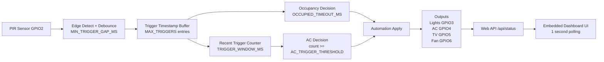
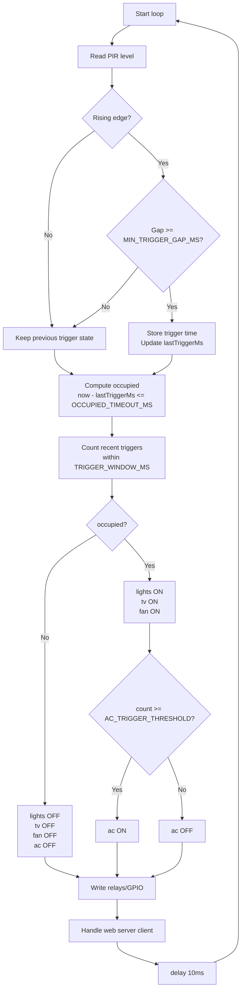

# Occupancy IoT Server (ESP32) — Dummy’s Guide (Single `.ino`, Wokwi Ready)

This project is now **single-file only**:

- `OccupancyIoTServer.ino` contains:
  - ESP32 logic
  - PIR occupancy algorithm
  - automatic control of Lights/Fan/TV/Air Con outputs
  - full modern web interface (embedded HTML/CSS/JS)

No LittleFS upload is needed.

---

## 1) What this project does (simple explanation)

Think of this as a smart room controller:

1. A **PIR sensor** detects movement.
2. If movement was detected recently, the room is considered **occupied**.
3. When occupied:
   - Lights = ON
   - TV = ON
   - Fan = ON
4. If movement triggers are frequent (more activity), then:
   - Air Con = ON

You can open a dashboard in your browser to see all statuses live.

Top branding in UI: **Greater Manchester EEE**  
Bottom subtle branding in UI: **AQ**

---

## 2) Files in this folder

- `OccupancyIoTServer.ino` -> the **only required code file**.
- `README.md` -> this guide.

If you still see an empty `data/` folder from older versions, it is not used.

---

## 3) Run in Wokwi (beginner-friendly step-by-step)

### A. Create simulation

1. Go to [https://wokwi.com](https://wokwi.com)
2. Click **New Project**.
3. Choose **ESP32** (ESP32 DevKit V1 is fine).
4. Replace the default code with contents of `OccupancyIoTServer.ino`.

### B. Add parts

Add these parts in Wokwi:

- 1x PIR Motion Sensor
- 4x LED (for simulation of Lights/Fan/TV/AC output states)
- 4x 220Ω resistors

Why LEDs? In Wokwi, LEDs are the easiest visible stand-in for relays/appliances.

### C. Wire exactly like this

#### Input

- PIR `VCC` -> ESP32 `3V3`
- PIR `GND` -> ESP32 `GND`
- PIR `OUT` -> ESP32 `GPIO2` (`PIR_PIN`)

#### Outputs (appliance channels)

- `LIGHT_PIN` = GPIO3 -> resistor -> LED -> GND
- `AC_PIN` = GPIO4 -> resistor -> LED -> GND
- `TV_PIN` = GPIO5 -> resistor -> LED -> GND
- `FAN_PIN` = GPIO6 -> resistor -> LED -> GND

ESP32-C3 note: avoid GPIO20/GPIO21 for this project on many boards, because they are often USB/JTAG related.

If you later use a real relay module, check relay polarity settings (explained below).

### D. Start simulation

1. Click the green **Play** button.
2. Open Serial Monitor (optional) to see AP info.
3. Simulate motion by toggling PIR output in Wokwi.
4. Watch LEDs and dashboard update.

### E. Open the web dashboard in Wokwi

When running, Wokwi shows a network URL for the ESP32 web server. Open it in your browser.

If you are testing on real hardware (not Wokwi), use:

- SSID: `GMU-Occupancy`
- Password: `changeme123`
- URL: `http://192.168.4.1/`

---

## 4) Dashboard quick tour

The web page includes:

- **Occupancy status** (PRESENT / IDLE)
- PIR live level (HIGH / LOW)
- Recent trigger count
- Last trigger time
- Device states for Lights/Fan/AC/TV
- AP SSID + IP info

It refreshes automatically every 1 second.

---

## 5) Tune behavior (important constants)

Open `OccupancyIoTServer.ino` and adjust:

- `OCCUPIED_TIMEOUT_MS`  
  How long after last PIR event room stays occupied.

- `TRIGGER_WINDOW_MS`  
  Time window used to count recent PIR triggers.

- `AC_TRIGGER_THRESHOLD`  
  Minimum trigger count in the window to turn AC on.

- `MIN_TRIGGER_GAP_MS`  
  Debounce/edge gap to avoid over-counting one long PIR pulse.

Example:

- Lower threshold -> AC turns on more easily.
- Higher threshold -> AC turns on only for busier activity.

---

## 6) Relay polarity (for real hardware later)

Many relay boards are **active-low** (LOW means ON).

In code:

- `RELAY_ACTIVE_LOW = true` for active-low relay modules (common)
- `RELAY_ACTIVE_LOW = false` for active-high devices

For Wokwi LEDs, either mode is fine as long as wiring matches what you expect.

---

## 7) How occupancy logic works (plain English)

1. PIR goes HIGH -> movement trigger captured.
2. Trigger timestamp is stored.
3. If latest trigger is not too old -> room = occupied.
4. Occupied -> Lights + TV + Fan ON.
5. Count triggers in recent window:
   - if count >= threshold -> AC ON
   - else AC OFF

This gives “basic occupancy comfort mode” with activity-sensitive AC use.

---

## 8) Pseudo block diagram

Pseudo interpretation:

- Sensor input enters edge detection.
- Valid triggers are timestamped in a rolling buffer.
- Occupancy and activity level are computed from time windows.
- Automation sets device states and writes GPIO outputs.
- API exposes state to the dashboard for live monitoring.

---

## 9) Flow chart of logic

---

## 10) Quick troubleshooting

### Dashboard not opening

- In Wokwi, ensure simulation is running and open the provided web URL.
- On real hardware, confirm you joined `GMU-Occupancy` WiFi.

### PIR not changing

- Confirm PIR `OUT` is connected to `GPIO2`.

### Hotspot not visible on ESP32-C3

- Open Serial Monitor at `115200` and reset the board.
- Look for `[OK] Hotspot started.` and the printed AP SSID/IP.
- If you see `[ERROR] WiFi.softAP() failed`, verify board selection is an ESP32-C3 board and power-cycle the board.
- In Wokwi, toggle PIR state manually.

### Outputs not behaving

- Check pin constants match your wiring.
- If using relays, toggle `RELAY_ACTIVE_LOW`.

### AC never turns on

- Reduce `AC_TRIGGER_THRESHOLD`.
- Increase `TRIGGER_WINDOW_MS`.

### Occupancy drops too fast

- Increase `OCCUPIED_TIMEOUT_MS`.

---

## 11) Arduino IDE upload guide (real ESP32, optional)

1. Install ESP32 board package from Espressif.
2. Select your ESP32 board and COM port.
3. Open `OccupancyIoTServer.ino`.
4. Click **Verify** then **Upload**.
5. Open Serial Monitor at `115200` baud.
6. Join AP and open dashboard URL.

No filesystem plugin needed because UI is embedded in code.

---

## 12) Security note

Before real deployment, change AP password in code:

- `kApPass = "changeme123"`

Use a strong password and avoid exposing this AP outside controlled environments.
