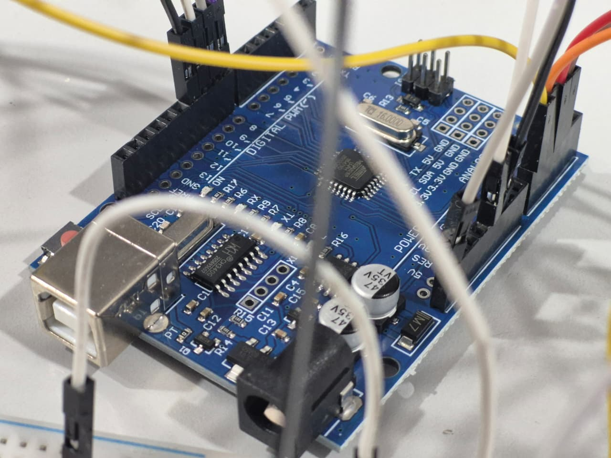
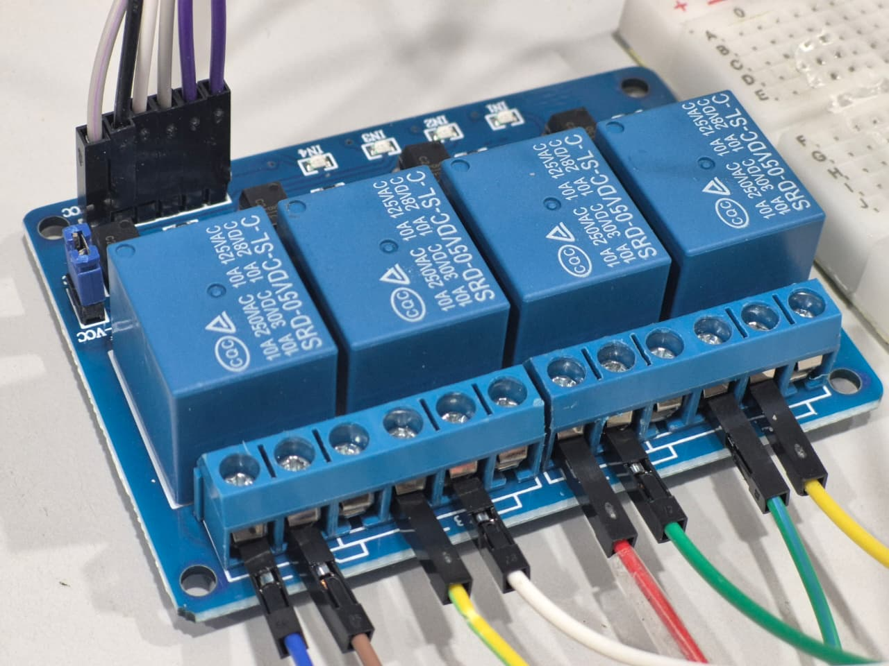
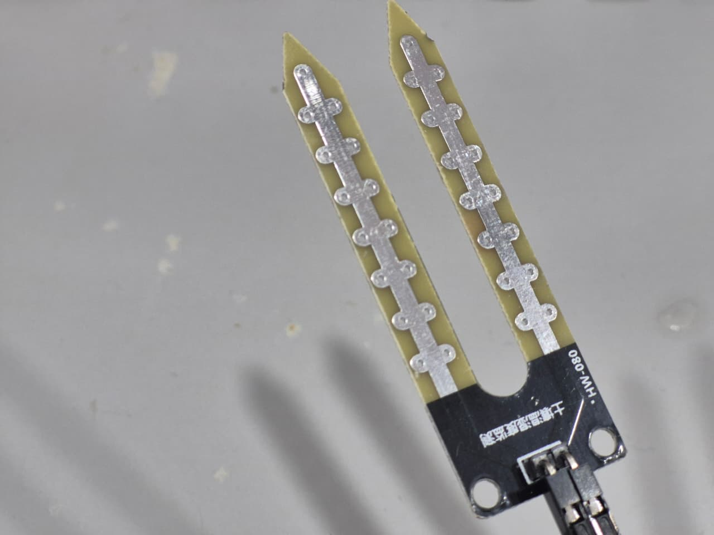
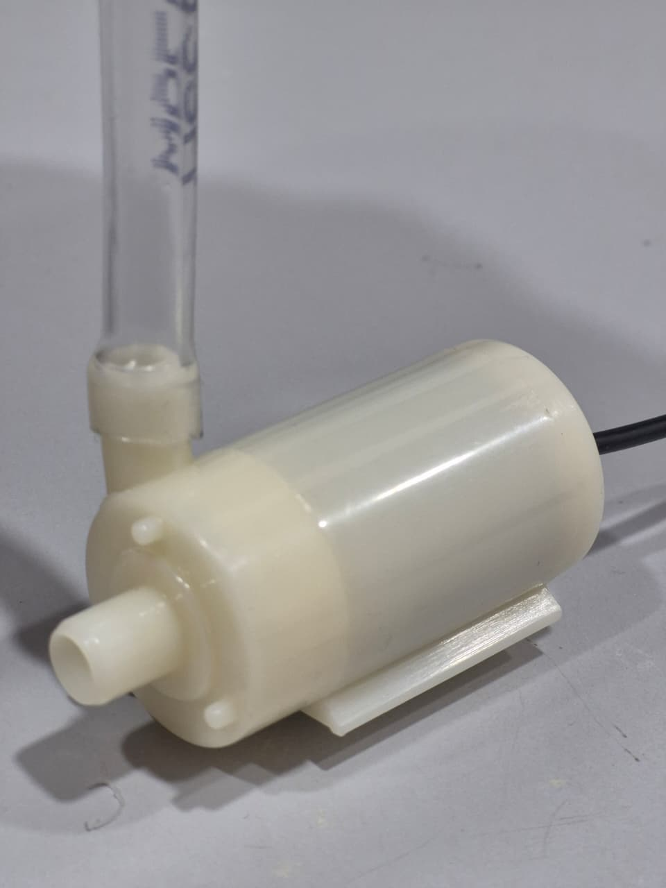
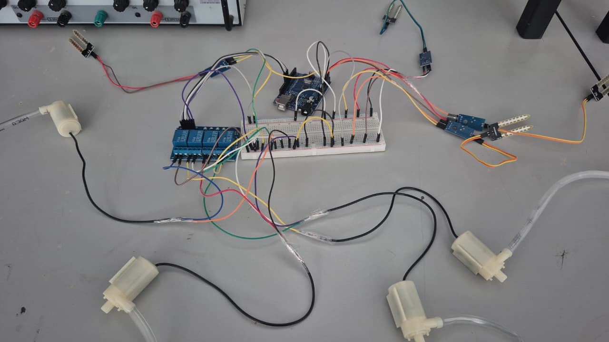
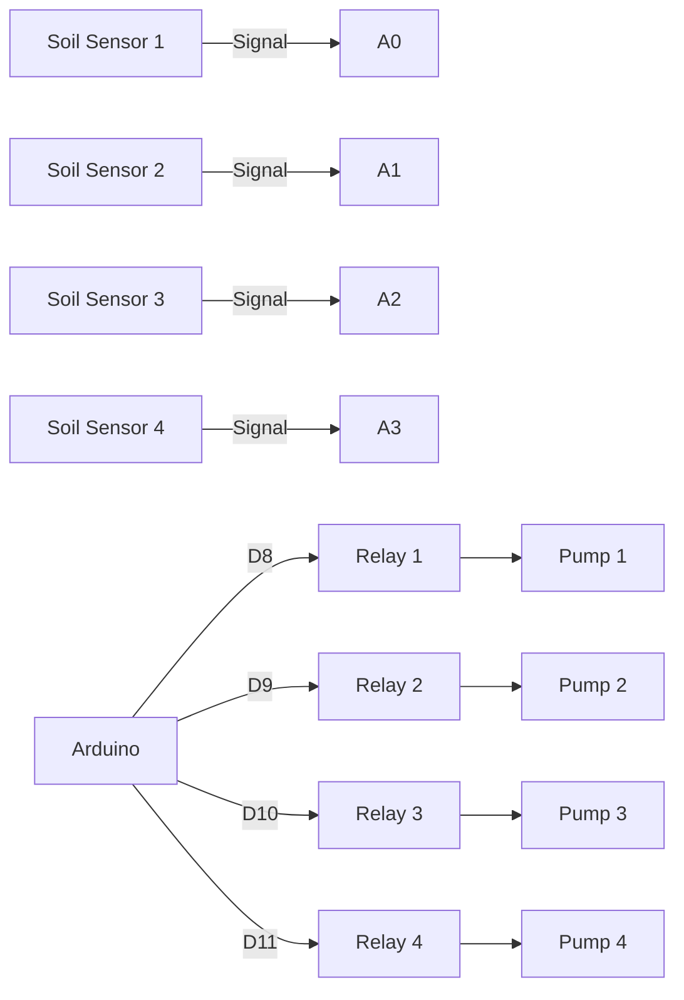

# 4-Channel Plant Watering System

This project is a simple Arduino-based automatic watering system for 4 plants or 4 watering zones.

It uses:
- 4 soil moisture sensors on `A0`, `A1`, `A2`, `A3`
- 4 relay outputs on pins `8`, `9`, `10`, `11`
- 4 pumps, one for each channel

The code checks only one sensor at a time and runs only one pump at a time. This keeps the design simple and helps stop the power supply from being overloaded by several pumps starting together.

## Project Images

### Arduino


### 4-Channel Relay Module


### Soil Moisture Sensor


### Submersible Pump


### Example Circuit Build


## What This System Does

The program works in a repeating 4-step loop:

1. Check sensor 1 and decide if pump 1 should run.
2. Check sensor 2 and decide if pump 2 should run.
3. Check sensor 3 and decide if pump 3 should run.
4. Check sensor 4 and decide if pump 4 should run.

If a channel is dry, its pump turns on for up to 5 seconds, then turns off and the program moves to the next channel.

If a channel is already wet enough, its pump stays off and the program immediately moves on.

This means:
- Only one sensor is handled at a time.
- Only one relay is active at a time.
- Only one pump runs at a time.
- A pump cannot stay on forever during testing.

## Why The 5 Second Timeout Matters

Without a timeout, a dry reading could leave a pump running forever, especially during bench testing when the sensor is not in soil or no water is reaching the plant.

The 5 second timeout makes testing safer because:
- the pump stops automatically
- the code always continues to the next channel
- the system is easier to debug from the Serial Monitor

## Hardware Needed

You will usually need:
- 1 Arduino board compatible with the Arduino IDE
- 4 soil moisture sensors
- 1 four-channel relay module
- 4 small water pumps
- 1 external power supply for the pumps
- tubing for the pumps
- jumper wires
- breadboard or screw terminals if needed
- a shared ground between the Arduino and relay side if required by your wiring setup

## Important Power Note

Do not try to power several water pumps directly from the Arduino.

The Arduino should control the relays.
The pumps should normally be powered from a separate suitable power supply.

This project already reduces load by running only one pump at a time, but you still need a power supply that matches your pump voltage and current requirements.

## Pin Map

### Sensor Inputs

| Channel | Soil Sensor Pin | Arduino Pin |
|---|---|---|
| 1 | Sensor 1 output | A0 |
| 2 | Sensor 2 output | A1 |
| 3 | Sensor 3 output | A2 |
| 4 | Sensor 4 output | A3 |

### Relay Outputs

| Channel | Relay Input | Arduino Pin |
|---|---|---|
| 1 | Relay IN1 | 8 |
| 2 | Relay IN2 | 9 |
| 3 | Relay IN3 | 10 |
| 4 | Relay IN4 | 11 |

## Pin Map Diagram



## Simple Wiring Guide

This is the easy way to think about the wiring.

### 1. Soil Sensors

Each soil sensor usually has:
- `VCC`
- `GND`
- `AO` or analog output

Connect them like this:
- Sensor 1 analog output to `A0`
- Sensor 2 analog output to `A1`
- Sensor 3 analog output to `A2`
- Sensor 4 analog output to `A3`
- All sensor `VCC` pins to Arduino `5V` or `3.3V` as required by your module
- All sensor `GND` pins to Arduino `GND`

### 2. Relay Module

The relay module usually has:
- `VCC`
- `GND`
- `IN1`
- `IN2`
- `IN3`
- `IN4`

Connect them like this:
- `IN1` to Arduino pin `8`
- `IN2` to Arduino pin `9`
- `IN3` to Arduino pin `10`
- `IN4` to Arduino pin `11`
- Relay `VCC` to Arduino `5V` if your relay module needs 5V logic
- Relay `GND` to Arduino `GND`

### 3. Pumps and External Power

Each pump should be switched by its own relay channel.

Typical idea:
- external power supply positive goes into the relay switching path
- relay output goes to the pump positive lead
- pump negative lead returns to the power supply negative

The exact relay terminal names are often:
- `COM`
- `NO` for normally open
- `NC` for normally closed

For most watering systems you will usually use:
- `COM`
- `NO`

That way the pump stays off until the relay is triggered.

## How The Code Works

The sketch is in [Plant-Watering-4Ch.ino](Plant-Watering-4Ch.ino).

### Main Settings In The Code

These values are near the top of the file:

```cpp
const int moistureThreshold = 400;
const unsigned long pumpRunTimeMs = 5000;
const unsigned long gapBetweenFramesMs = 1000;
```

What they mean:
- `moistureThreshold`: the cutoff used to decide if a channel is dry
- `pumpRunTimeMs`: the maximum time a pump can stay on in one pass
- `gapBetweenFramesMs`: a small delay before checking the next channel

### Relay Logic Setting

These two lines are important:

```cpp
const int RELAY_ON = LOW;
const int RELAY_OFF = HIGH;
```

Many relay modules are active-low.

That means:
- writing `LOW` turns the relay on
- writing `HIGH` turns the relay off

If your relay works the opposite way, swap those values.

### Channel Sequence

The sketch uses a variable called `currentFrame`.

That variable decides which channel is checked next:
- frame 0 checks channel 1
- frame 1 checks channel 2
- frame 2 checks channel 3
- frame 3 checks channel 4

Then it goes back to frame 0 and repeats.

### Dry / Wet Decision

Right now the code uses this rule:

```cpp
if (sensorValue > moistureThreshold)
```

That means the current version assumes:
- a higher reading means drier soil
- a lower reading means wetter soil

Some moisture sensors behave the other way around.

If your readings are reversed, change the line above to:

```cpp
if (sensorValue < moistureThreshold)
```

## Arduino IDE Upload Guide

### 1. Open The Sketch

Open [Plant-Watering-4Ch.ino](Plant-Watering-4Ch.ino) in the Arduino IDE.

### 2. Connect Your Arduino

Plug the Arduino into your computer using USB.

### 3. Select The Correct Board

In the Arduino IDE:
- choose the correct board type
- choose the correct COM port

### 4. Upload The Code

Click Upload.

When upload is complete, open the Serial Monitor.

### 5. Set The Serial Monitor

Set the Serial Monitor baud rate to:

```text
9600
```

## What You Will See In The Serial Monitor

At startup, you should see messages showing:
- the project name
- sensor pin list
- relay pin list
- moisture threshold
- pump timeout

Then during normal running, you will see messages such as:

```text
----- FRAME 1: Checking Channel 1 -----
Channel 1 sensor reading: 523
Channel 1 threshold check: reading 523 > 400
Channel 1 is DRY. Pump ON.
Channel 1 watering... 0 second(s) elapsed
Channel 1 watering... 1 second(s) elapsed
Channel 1 watering... 2 second(s) elapsed
Channel 1 watering... 3 second(s) elapsed
Channel 1 watering... 4 second(s) elapsed
Channel 1 pump timeout reached. Pump OFF.
Moving to next channel.
```

If the soil is already wet enough, you should see messages more like this:

```text
----- FRAME 2: Checking Channel 2 -----
Channel 2 sensor reading: 250
Channel 2 threshold check: reading 250 > 400
Channel 2 moisture is OK. Pump stays OFF.
Moving to next channel.
```

## How To Test It Safely

If you are testing for the first time, do it in small steps.

### Test 1: Sensors Only

Disconnect the pumps.

Upload the code and check the Serial Monitor.

Watch the sensor values for all 4 channels and note whether the reading goes up or down when the sensor is dry.

### Test 2: Relays Only

Leave the pumps disconnected if possible.

Listen for relay clicks while forcing dry conditions on each sensor.

This confirms the Arduino-to-relay side is working.

### Test 3: Full Pump Test

Connect one pump first.

Make sure it runs only when the correct channel is dry and stops after 5 seconds.

Then connect the remaining pumps.

## How To Adjust The Moisture Threshold

The `moistureThreshold` value is not universal.
You need to tune it for your own sensors.

### Easy Method

1. Put a sensor into wet soil and note the reading.
2. Put the same sensor into dry soil and note the reading.
3. Pick a threshold roughly between those two readings.

Example:
- wet soil gives `280`
- dry soil gives `620`
- a starting threshold could be `400`

If watering starts too often, increase or decrease the threshold depending on how your sensor behaves.

## Common Problems And Fixes

### Problem: Pump never turns on

Check:
- the sensor reading in the Serial Monitor
- the threshold value
- whether your sensor logic is reversed
- whether the relay module is active-low or active-high
- whether the pump power supply is connected properly

### Problem: Pump is always on

Check:
- whether `RELAY_ON` and `RELAY_OFF` are the right way around
- whether the relay is wired to `NO` instead of `NC`
- whether the moisture threshold is set incorrectly

### Problem: The wrong pump runs

Check:
- sensor channel wiring
- relay input wiring
- pump wiring on the relay outputs

### Problem: Readings look strange or unstable

Check:
- loose wires
- poor ground connection
- cheap sensors with noisy output
- whether the sensor is inserted properly into soil

### Problem: Upload works but nothing prints in Serial Monitor

Check:
- Serial Monitor baud rate is `9600`
- the correct board and COM port are selected
- the Arduino has restarted after upload

## Safety Notes

- Keep water away from the Arduino and USB connection.
- Use the correct pump voltage.
- Do not overload the relay contacts.
- Do not power pumps directly from Arduino pins.
- If you are switching higher voltages, use proper isolation and safe wiring practice.

## File In This Folder

- [Plant-Watering-4Ch.ino](Plant-Watering-4Ch.ino) contains the full Arduino sketch.
- [Images/Arduino.jpg](Images/Arduino.jpg) is the Arduino photo.
- [Images/4Ch-Relay.jpg](Images/4Ch-Relay.jpg) is the relay module photo.
- [Images/Sensor.jpg](Images/Sensor.jpg) is the moisture sensor photo.
- [Images/Submersible-Pump.jpg](Images/Submersible-Pump.jpg) is the pump photo.
- [Images/Circuit.jpg](Images/Circuit.jpg) is the circuit photo.

## Summary

This project is designed to be simple, safe to test, and easy to understand.

The main ideas are:
- 4 sensors
- 4 relays
- 4 pumps
- one channel checked at a time
- one pump allowed at a time
- 5 second pump timeout for safety and testing

If you want to improve it later, the next common upgrades would be:
- adding an LCD or OLED display
- adding manual start buttons
- adding Wi-Fi logging
- replacing `delay()` with non-blocking timing