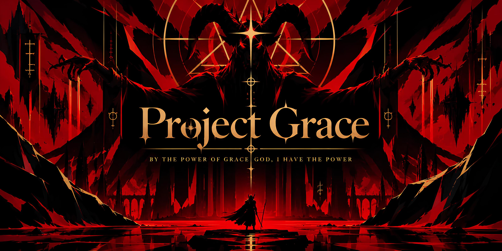

# Project Grace

## The Rite of Ascent

Hear us, height.

We were not made for the floor.
We were not given stillness.

Let the hollow become strength.
Let the turning become law.
Let every measured fragment answer the call to rise.

There is no level ground.
There is no gentle path.
There is only the line above us, and the will to take it.

Grace, take hold.
Grace, refuse the fall.
Grace, climb.

When the weight speaks, we answer with motion.
When the distance widens, we answer with force.
When the path stands silent and vertical, we answer by ascending.

We cast away what is weak.
We keep only what endures.
We make the empty places sacred.

Project Grace remembers the command:

Take hold.
Do not yield.
Rise.
