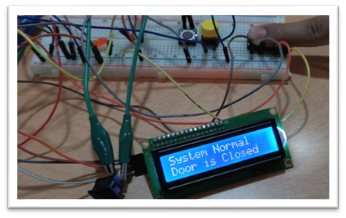

# Refrigeration Room Door Monitor

This project is an Arduino-based monitoring system designed for supermarket refrigerated areas. It helps prevent energy waste and product spoilage by ensuring that large refrigerator doors are not left open longer than necessary. The system uses redundant switches, visual and audible indicators, and an LCD display to alert staff and log door open times, with increasing urgency the longer the door is left open. It is robust, user-friendly, and designed to handle unexpected events such as switch faults.

---

## Scenario & Client Brief

Supermarket employees frequently access refrigerated areas, often leaving doors open due to distractions or stacking issues. With over 200 door openings daily, even small delays in closing the doors can lead to significant energy waste and increased costs. The client requires:

- At least two different indicators to show that the doors are open.
- A safe system to monitor and display the time the doors are open.
- Indicators that become more noticeable the longer the doors are left open.
- The ability to handle unexpected events (e.g., switch faults).
- A system disable function for maintenance.
- A test mode for diagnostics.

---

## Features

- **Redundant Door Monitoring:** Two switches ensure reliable detection and error checking.
- **Visual & Audible Alerts:** LED and buzzer indicate door open status, with beeping patterns that escalate over time.
- **LCD Status Display:** Shows door status, error messages, and time open in seconds.
- **Error Detection:** Detects and displays switch mismatches or faults.
- **System Disable Mode:** Maintenance switch disables outputs safely.
- **Self-Test Function:** Test button activates all outputs for quick diagnostics.
- **Automatic Restart:** Relay-based power cycling to prevent timer overflow.
- **Fully Annotated Code:** For educational and maintenance purposes.

---

## Hardware Requirements

- **Arduino Uno** (or compatible)
- **2x Limit Switches** (for door state)
- **LED** (door open indicator, with 220Ω resistor)
- **Active Buzzer** (audible alert)
- **16x2 I2C LCD Display** (status and timer)
- **Relay Module** (for power cycling)
- **System Disable Switch** (maintenance)
- **Test Button** (output diagnostics)
- **Restart Button** (manual power cycle)
- **Breadboard & Wires**

---

## Pin Assignments

| Component         | Pin      |
|-------------------|----------|
| LED               | 13       |
| Buzzer            | 10       |
| Switch 1          | 11       |
| Switch 2          | 12       |
| Test Button       | 8        |
| System Disable    | 4        |
| Restart Button    | 5        |
| Relay             | 6        |
| LCD I2C Address   | 0x27     |

---

## System Design

### Inputs

- **Switch 1 & Switch 2:** Detect door open/closed state. Redundancy ensures reliability and allows detection of faults (e.g., stuck or broken switch).
- **System Disable Switch:** Allows maintenance without triggering alarms or outputs.
- **Test Button:** Activates all outputs for diagnostics.
- **Restart Button:** Triggers relay to power-cycle Arduino for overflow protection.

### Outputs

- **LED:** Primary visual indicator. ON when door is open, OFF when closed.
- **Buzzer:** Audible alert. OFF when door is closed, slow beeping after 30 seconds open, fast beeping after 60 seconds.
- **Relay:** Disconnects and restores power for safe system restart.
- **LCD Display:** Shows system status, time open, and error messages.

### Microcontroller

- **Arduino Uno:** Chosen for its versatility, built-in pull-ups, and sufficient I/O for all components.

### Wiring & Protection

- **Breadboard:** For easy prototyping and modification.
- **220Ω Resistor:** Limits current to the LED for safety and longevity.

---

## System Operation

1. **Normal Operation:**
    - Both switches closed: Door is closed, all indicators OFF.
    - Both switches open: Door is open, LED ON, timer starts, LCD shows time open.
    - After 30 seconds: Buzzer slow-beeps (short beep, long pause).
    - After 60 seconds: Buzzer fast-beeps (short beep, short pause).
2. **Error Handling:**
    - If switches disagree (one open, one closed): Error displayed on LCD, buzzer beeps, LED flashes.
3. **System Disable:**
    - Maintenance switch disables outputs and displays "System Disabled" on LCD.
    - System continues to track time for logging, but does not alert.
4. **Self-Test:**
    - Test button activates all outputs (LED, buzzer, relay) and displays "Test" on LCD.
5. **Restart:**
    - Restart button or timer overflow triggers relay to power-cycle Arduino, preventing timer overflow errors.

---

## Flowchart


---

## Schematic


---

## File Structure

```
Refrigeration Room Monitor/
├── RoomMonitor.ino
├── FlowChart.png
├── Schematic.jpg
└── README.md
```

---

## Test Plan

| Test No. | Purpose of Test | Test Condition | Expected Result | Actual Result | Comments and Justification |
|----------|-----------------|---------------|----------------|--------------|---------------------------|
| 1 | Detect door open state | Run the program and press both switches (simulate door open) | LED should turn ON and display should show the time open | LED turns ON when the doors open | Immediate, clear visual feedback. The LED is distinct but not intrusive, suitable for frequent use. A visual indicator is sufficient for short periods, unlike a buzzer which would be disruptive if triggered every time. |
| 2 | Buzzer slow beeps after 30s | Run the program and wait for 30 seconds with door open | Buzzer should slow beep and LED should be ON | Buzzer starts slow beeping when the count becomes 31 and higher | Slow beeping is a good indication that attention may be needed. The sound is noticeable even if the operator is not looking at the display or LED, and is less likely to be ignored than a constant tone. |
| 3 | Buzzer fast beeps after 60s | Run the program and wait for 90 seconds with door open | Buzzer should fast beep and LED should be ON | Buzzer starts fast beeping when the count becomes 61 and higher | Fast beeping is urgent and hard to miss, signaling that the door has been open for an excessive amount of time. The different beep patterns help users distinguish between moderate and excessive open times without needing to check the display. |
| 4 | Detect switch fault condition | Set switches to different positions (simulate fault) | Buzzer should beep and display should show error | Buzzer beeps and display flashes error type | Redundant switches allow detection of faults such as stuck or broken switches. Any mismatch triggers a clear error, alerting the operator to investigate and resolve the issue. |
| 5 | System disable works | Toggle the disable switch while the program is running | Display should show "System Disabled" | System stops giving output, display shows disabled | The system can only be disabled when doors are closed, preventing tampering. If disabled during open, time is still tracked for logging. When re-enabled, outputs resume according to the current state. This ensures resilience to unexpected events and maintenance needs. |
| 6 | Restart works | Press the power toggle button | System cuts power and reboots | Power is cut and system boots up again | Automatic restart prevents timer overflow errors. The restart is quick (~1s), minimizing disruption. The system refuses to restart if the doors are open, protecting time tracking accuracy. |
| 7 | Output test works | Press the test button | All outputs turn on | LED and buzzer turn on, display shows test | The test button is useful for routine diagnostics and maintenance, allowing all outputs to be checked without manual disassembly. Ensures reliable operation over time. |

---

## Usage

1. **Wire up the hardware** according to the schematic above.
2. **Upload** `RoomMonitor.ino` to your Arduino Uno.
3. **Power on** the system.
4. **Test** using the test button and run through the test plan above.
5. **Monitor** door status and alerts via LED, buzzer, and LCD.


---

## Hardware Testing

Below are images showing the system in various test states:

### Door Closed (Normal Operation)


---

### Door Open (Timer Running)


---

### System Disabled (Maintenance Mode)


---

### Output Test (All Outputs Activated)

---


## Customization

- **Alert Timing:** Adjust the 30s/60s thresholds in code for your needs.
- **Buzzer Patterns:** Modify beep durations for different urgency levels.
- **LCD Messages:** Customize status and error messages for clarity.
- **Relay Logic:** Adapt for different power cycling requirements.

---

## Notes

- The system is designed for reliability and safety, with redundancy and error detection.
- All code is heavily commented for clarity and future maintenance.
- Test plan includes both routine and unexpected events.
- See flowchart and schematic for logic and wiring.

---

## License

This project is for educational and demonstration purposes only.
