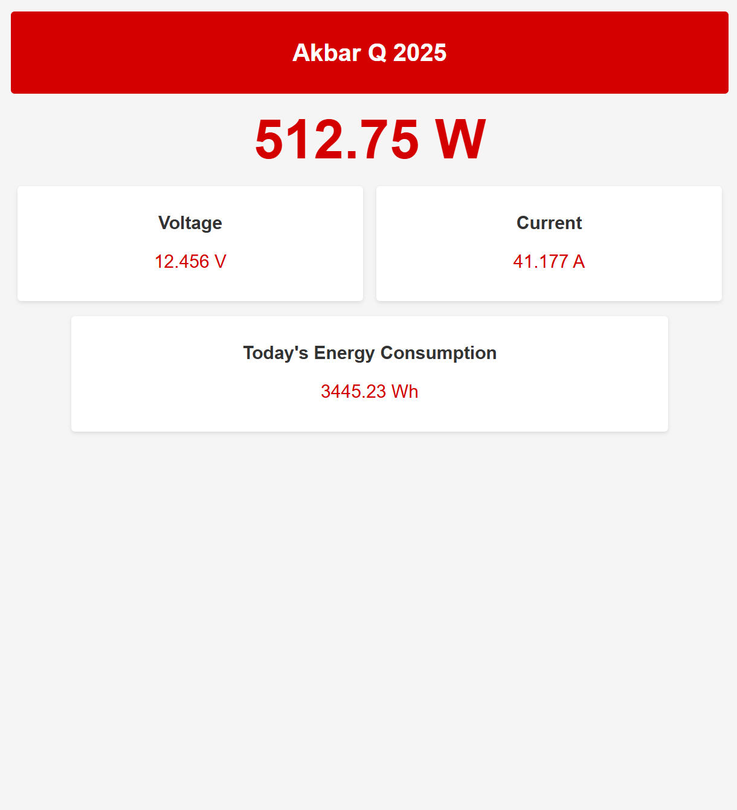

# Simple Power Meter Server

This mini project demonstrates a simple ESP32-based power meter that measures voltage and current, calculates power and daily energy consumption, and serves the results on a WiFi Access Point as a live-updating web page. The project includes a standalone HTML file for previewing the web interface and a rendered image for quick reference.

---

## Features

- **ESP32 Access Point:** The ESP32 creates its own WiFi network for direct connection.
- **Live Web Dashboard:** Real-time display of voltage, current, power, and daily energy consumption.
- **Auto-Refreshing Webpage:** The dashboard updates every second.
- **Standalone HTML Preview:** `DummyHTML.html` lets you preview the dashboard design in any browser.
- **Rendered Example:** `Render.png` shows what the live dashboard looks like.

---

## Libraries Required

- **WiFi.h** (built-in with ESP32 Arduino core)
- **WebServer.h** (built-in with ESP32 Arduino core)

No external libraries are required.

---

## File Structure

```
SimplePowerMeterServer/
├── SimplePowerMeterServer.ino   # Main ESP32 code
├── DummyHTML.html               # Standalone HTML preview
├── Render.png                   # Rendered dashboard image
└── README.md                    # This file
```

---

## How It Works

1. **ESP32 Setup:** The ESP32 runs as a WiFi Access Point (`PowerMonitorAP`).
2. **Measurement:** Reads voltage from an analog pin, calculates current (using a fixed resistor value), power, and accumulates daily energy.
3. **Web Server:** Serves a styled HTML dashboard at `http://192.168.4.1/` (default AP IP).
4. **Auto-Refresh:** The dashboard updates every second with new readings.

---

## Preview

You can preview the dashboard design without hardware by opening `DummyHTML.html` in your browser.

**Rendered Example:**



---

## Usage

1. **Upload** `SimplePowerMeterServer.ino` to your ESP32.
2. **Connect** to the WiFi network `PowerMonitorAP` (password: `12345678`).
3. **Open** a browser and go to `http://192.168.4.1/` to view the live dashboard.
4. **Preview** the dashboard design by opening `DummyHTML.html` in any browser.

---

## Customization

- **Resistor Value:** Change the `R` value in the code to match your hardware.
- **ADC Pin:** The code uses GPIO34 for voltage measurement; adjust if needed.

---

## License

This project is for educational and demonstration
