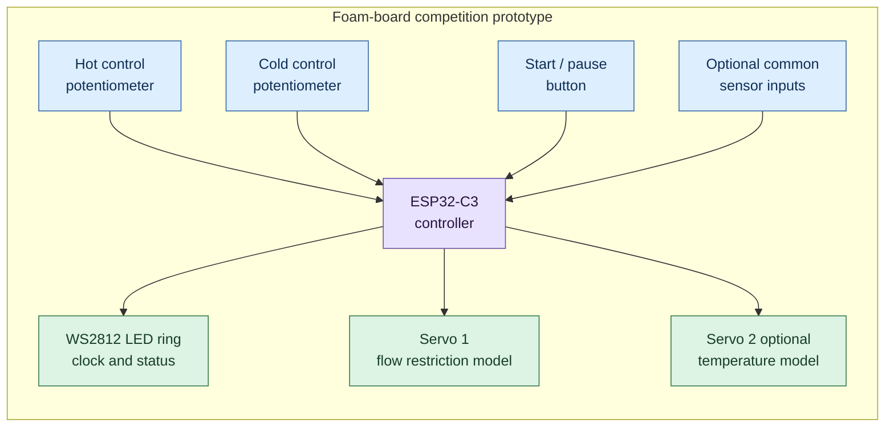
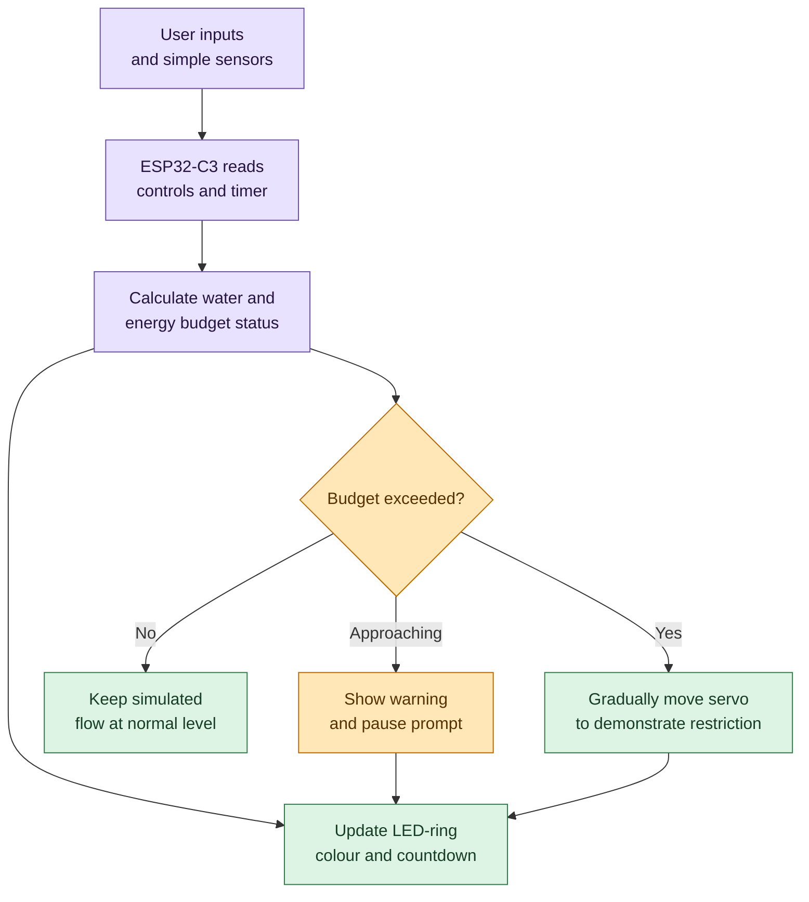
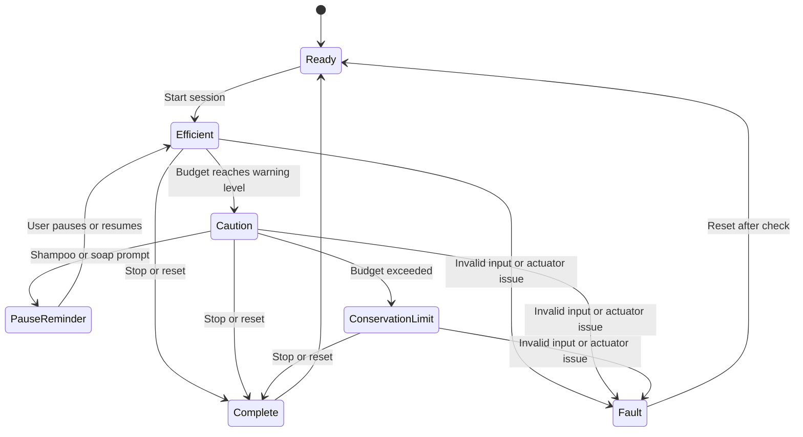

# Smart Shower Water Conservation System

> A water-conservation competition prototype that makes shower time, flow demand, and waste visible in the moment, then progressively reduces flow when use exceeds a configured allowance.

## Project Description

The Smart Shower Water Conservation System is an interactive shower-control concept designed to reduce avoidable domestic water consumption while keeping the user in control of their preferred temperature and shower experience.

Two potentiometers model the hot- and cold-water tap handles. Their positions show how far each supply has been opened and allow the controller to estimate overall demand and the selected hot/cold balance. Water then passes through a water-saving atomiser at the shower outlet, providing a usable spray while reducing the volume required. A servo motor controls a low-voltage prototype restriction valve in the water path. As a shower approaches or exceeds its configured time allowance, the controller warns the user and progressively reduces the permitted flow instead of abruptly stopping it.

A WS2812 addressable LED ring is both the user interface and visual clock. It displays the time remaining, the current water-use status, and reminders to pause water during activities such as shampooing or soaping. The project is intended as an educational competition prototype. Any full-size installation must use pressure-rated, potable-water-safe plumbing parts and professionally appropriate electrical isolation.

## Prototype Overview

The competition model represents a smart shower on a foam board. It simulates user choices and shows the system response; it is not a real plumbing installation.



The LED ring is the main visual output: green shows efficient use, amber/orange warns that the budget is being used quickly, blue prompts a pause, and red shows the conservation limit.

## Problem Being Addressed

Long showers and leaving water running during non-rinsing activities waste treated water and, when hot water is used, the energy needed to heat it. Users often receive no useful feedback until the utility bill arrives. This project brings the decision point into the shower:

- It shows a clear time budget while water is being used.
- It distinguishes light, reasonable, and excessive use through an easy-to-read light ring.
- It prompts the user to pause the water for shampooing or soaping.
- It automatically moderates flow after a warning period.
- It retains a manual, safe way to restore or stop the prototype during demonstration.

## Project Objectives

1. Measure separate hot- and cold-handle positions with analogue inputs.
2. Estimate water-demand level from the two handle positions.
3. Reduce outlet consumption with a suitable shower atomiser/aerating nozzle.
4. Display a countdown and conservation status with a WS2812 LED ring.
5. Detect prolonged or high-demand water use and issue escalating prompts.
6. Drive a servo-controlled prototype valve to restrict flow progressively after the time threshold.
7. Provide a repeatable, measurable competition demonstration of water savings.

## Core Features

| Feature | Purpose |
|---|---|
| Hot potentiometer | Represents the hot-water tap opening and contributes to demand estimation. |
| Cold potentiometer | Represents the cold-water tap opening and contributes to demand estimation. |
| Water-saving atomiser | Lowers outlet water consumption while maintaining a shower spray. |
| Servo restriction valve | Progressively limits water flow after warnings or an exceeded time allowance. |
| WS2812 LED ring | Displays time, conservation score, warnings, and the current operating state. |
| Pause reminders | Encourages water-off periods during shampooing, soaping, and similar tasks. |
| Configurable thresholds | Allows judges or developers to set different time budgets and response levels. |

## Proposed Hardware

### Controller and User Interface

| Item | Quantity | Role |
|---|---:|---|
| ESP32-C3 development board | 1 | Reads inputs, runs the conservation algorithm, controls the LEDs and servo. |
| 10 kOhm linear potentiometer | 2 | Represents hot- and cold-tap openings. |
| WS2812B LED ring, 16 or 24 LEDs | 1 | Countdown clock and colour status display. |
| Momentary push button | 1-2 | Optional start/reset and pause/acknowledge controls. |
| Buzzer, optional | 1 | Optional audible warning where allowed in the competition. |

### Water-Path Demonstrator

| Item | Quantity | Role |
|---|---:|---|
| Water-saving shower atomiser/nozzle | 1 | Produces a lower-consumption shower spray. |
| Servo-driven prototype valve or pinch valve | 1 | Restricts a low-pressure demonstrator water path. |
| Servo motor with suitable torque | 1 | Moves the restriction valve to the requested setting. |
| Clear low-pressure tubing and reservoir/pump | As needed | Enables a visible, recirculating demonstration without connecting to mains plumbing. |
| Inline hall-effect flow sensor | 1 | Measures the total outlet flow so the system can count litres used. |
| Simple water-leak sensor, optional | 1 | Detects water beneath the plumbing rig and triggers a visible fault warning. |

### Electrical Support Components

- Dedicated regulated $5\,\mathrm{V}$ supply sized for the servo and LED ring.
- Common ground between the controller, WS2812 ring, and servo supply.
- $330\,\Omega$ resistor in series with the WS2812 data line.
- $1000\,\mu\mathrm{F}$ capacitor across the LED ring power input.
- Logic-level shifter for the WS2812 data line when a $3.3\,\mathrm{V}$ ESP32 signal is unreliable.
- A voltage divider or logic-level shifter for a flow sensor with a $5\,\mathrm{V}$ pulse output; ESP32-C3 GPIO pins are not $5\,\mathrm{V}$ tolerant.
- Suitable fuse, switch, waterproof enclosure, strain relief, and insulated connectors.

### Simple Sensor Set

This version deliberately uses common Arduino-compatible parts and only one sensor that directly measures water use:

| Input | Recommended part | Why it matters |
|---|---|---|
| Hot handle position | 10 kOhm potentiometer | Shows the selected hot-water opening. |
| Cold handle position | 10 kOhm potentiometer | Shows the selected cold-water opening. |
| Total water use | Inline hall-effect flow sensor | Counts pulses to calculate flow rate and litres used; this is the key conservation sensor. |
| Leak detection, optional | Resistive water-leak sensor module | Detects a spill below the prototype and places the system in a warning state. |

Install the single flow sensor after the hot and cold streams have mixed, or at the demonstrator outlet, so it measures total water consumed. Use it as the source of truth for the litre budget. The potentiometers remain useful as a visual demonstration of user demand, but they do not replace flow measurement.

## System Architecture



The potentiometers are interface inputs for the competition prototype; they do not directly open household valves. The controller uses timer-based thresholds and the simulated control positions to make the conservation decision.

## Suggested ESP32-C3 Connections

These assignments suit ESP32-C3 development boards that expose the listed GPIO pins. Confirm the pin labels on the selected board before wiring. Avoid using boot-strapping pins GPIO2, GPIO8, and GPIO9 for the sensors or outputs below.

| Connection | Suggested ESP32 GPIO | Notes |
|---|---:|---|
| Hot potentiometer wiper | GPIO0 / ADC1_CH0 | Connect potentiometer ends to $3.3\,\mathrm{V}$ and ground only. |
| Cold potentiometer wiper | GPIO1 / ADC1_CH1 | Connect potentiometer ends to $3.3\,\mathrm{V}$ and ground only. |
| Flow-sensor pulse output | GPIO4 | Use an interrupt; level-shift the signal if the sensor output exceeds $3.3\,\mathrm{V}$. |
| Leak-sensor analogue output, optional | GPIO3 / ADC1_CH3 | Ensure the module output cannot exceed $3.3\,\mathrm{V}$. |
| WS2812 data input | GPIO7 | Add the series resistor close to the LED ring. |
| Servo control signal | GPIO5 | Power the servo from its own adequate $5\,\mathrm{V}$ rail. |
| Start/reset button | GPIO10 | Use an internal pull-up and wire the button to ground. |

The ESP32-C3 analogue inputs are GPIO0 to GPIO4. ESP32 ADC readings can vary between boards, so calibrate both potentiometers in software instead of assuming their raw end values.

## How It Works

### 1. Start and Calibration

At power-on, the servo moves to its defined normal-flow position and the LED ring indicates `READY`. Before a demonstration, the system records or loads the fully closed and fully open reading for each potentiometer. A button press begins the shower session and starts the countdown.

### 2. Demand Estimate

Each potentiometer is converted into an opening percentage from $0\%$ to $100\%$. The first prototype can calculate a demand index using:

$$
D = \frac{H + C}{2}
$$

where $H$ and $C$ are the calibrated hot and cold opening percentages. This gives a straightforward indication of how widely the controls are opened. It is not a measurement of litres per minute; pressure, valve geometry, and the atomiser also affect real flow.

The inline flow sensor supplies pulses that the ESP32-C3 counts to calculate measured flow rate $F$:

$$
V = \int_0^T F(t)\,dt
$$

where $V$ is water volume used during a session and $T$ is shower time. This gives the project a defensible, measurable water-saving result for competition judging.

### 3. Time and Use Assessment

The controller continually checks:

- Elapsed shower time.
- Remaining time in the target shower budget.
- Measured flow rate and total litres used.
- Handle-derived demand as a secondary visual indicator.
- Whether the user has entered a shampoo/soap pause interval.
- The current valve restriction level.

An initial configuration may use a five-minute target. The thresholds below are deliberately editable and should be tuned after observing the atomiser's real output.

| State | Example condition | LED-ring behaviour | Valve action |
|---|---|---|---|
| Ready | Session not started | Soft white pulse | Normal-flow position. |
| Efficient | $0$-$60\%$ of time budget and moderate demand | Green countdown arc | No restriction. |
| Caution | $60$-$80\%$ of budget, or sustained high demand | Yellow/amber arc | No restriction or a small configurable limit. |
| Pause reminder | Shampoo/soap prompt or no rinsing activity selected | Blue rotating prompt | Encourage user to close the taps; no automatic closure by default. |
| Warning | $80$-$100\%$ of budget | Orange arc with short red flashes | Apply a gentle flow cap if enabled. |
| Conservation limit | Budget exceeded | Red countdown or red pulse | Increase restriction gradually to a safe configured maximum. |
| Complete | User ends session or maximum duration reached | Blue/white completion display | Return to normal-flow position after the water path is safely stopped. |
| Fault/safe state | Sensor or actuator fault | Alternating red/white | Move to the documented safe mechanical position and show fault. |

### 4. Progressive Restriction

The restriction valve should not snap closed just because a time threshold is crossed. A staged response gives clear feedback and avoids a startling change in the shower spray. One possible policy is:

| Elapsed time | Example restriction target |
|---|---:|
| 0 to 4:00 | 0% restriction |
| 4:00 to 5:00 | 15% restriction, with amber warning |
| 5:00 to 6:00 | 35% restriction, with red warning |
| More than 6:00 | 50% maximum restriction until the session is ended or reset |

Servo angles must be calibrated experimentally because valve motion and restriction are not linear. The software should move in small steps, such as one or two degrees at a time, and wait between steps. Never assume a servo position corresponds to a known flow percentage without collecting measurements.

## WS2812 LED Ring Design

The LED ring has two simultaneous jobs: an intuitive clock and a conservation indicator.

### Countdown Clock

- Divide the configured time budget across the available LEDs.
- Light an arc for the time remaining; extinguish LEDs one at a time as the session progresses.
- Use a moving marker or brief pulse to make the countdown legible on rings with fewer LEDs.
- Reserve one or two LEDs for warning overlays so the current state is visible without reading a display.

### Conservation Feedback

| Colour | Meaning |
|---|---|
| Green | Water use is within the configured target. |
| Amber | Time or demand is approaching the preferred limit. |
| Orange | The user should reduce demand or finish rinsing. |
| Red | Time budget exceeded; flow restriction is active or imminent. |
| Blue | Pause water while shampooing or soaping. |
| White | Ready, calibration, reset, or completion state. |
| Alternating red/white | Hardware or sensor fault requiring attention. |

Avoid relying on colour alone. Animation speed, the remaining-time arc, and optional buzzer patterns should communicate the same change for users with colour-vision differences.

## Shampoo and Soap Reminder Logic

The system should be encouraging rather than intrusive. The initial algorithm can provide timed reminders without claiming to know exactly what the user is doing:

1. After an initial wetting period, show a blue prompt: `Pause water for shampoo or soap`.
2. Allow the user to acknowledge the prompt with a button, or let it clear automatically after a short interval.
3. If the handles remain at high demand during the reminder, escalate from blue to amber and then to orange.
4. Do not close the valve solely because a reminder appeared; apply progressive restriction only according to the configured time and demand policy.
5. Record a paused interval as a positive conservation event when a flow sensor confirms near-zero flow.

For a more advanced version, add a waterproof capacitive button labelled `SOAP/SHAMPOO PAUSE`. Pressing it begins a selected pause interval, changes the LED ring to blue, and returns the valve to normal control when the user resumes.

## Conservation Score

For a competition display, the project can calculate a simple score that rewards shorter sessions, lower demand, and confirmed pauses. An example starting model is:

$$
S = 100 - 40\left(\frac{T}{T_{target}}\right) - 35\left(\frac{\bar{D}}{100}\right) + 10P
$$

where:

- $S$ is the conservation score, clamped between $0$ and $100$.
- $T$ is session duration.
- $T_{target}$ is the target session duration.
- $\bar{D}$ is average estimated demand percentage.
- $P$ is $1$ when a confirmed pause is detected, otherwise $0$.

This formula is a demonstration metric. Once a flow sensor is installed, replace the demand component with measured litres used relative to a target volume. Present both baseline and atomiser-assisted readings to show the atomiser's contribution honestly.

## Control-State Outline



The visible progression for a demonstration is `green -> amber -> blue prompt -> red restriction -> white complete`, making the conservation logic easy for judges to follow from a distance.

## Build Plan

1. **Build the electronic bench test.** Read both potentiometers, show their values in the serial monitor, and verify the LED-ring colours and countdown.
2. **Calibrate the servo safely.** Test its angle range without water, determine the normal-flow and maximum-permitted-restriction positions, and add movement limits in firmware.
3. **Assemble a low-pressure closed-loop demonstrator.** Use a reservoir, small pump, clear tubing, valve, atomiser, and return container. Keep all electronics outside the splash zone.
4. **Measure a baseline.** Time the collection of a known volume without the atomiser or restriction policy, then repeat with the atomiser.
5. **Test the progressive policy.** Run repeatable timed sessions and observe the reduction after each threshold.
6. **Add flow sensing.** Compare estimated demand from the potentiometers with actual flow to improve the algorithm and evidence.
7. **Prepare the demonstration.** Label the inputs, make the water path visible, and provide a short before/after data table for judges.

## Demonstration Script

1. Show the LED ring in the white `READY` state and explain the configured shower-time budget.
2. Turn the hot and cold potentiometers to show their independent readings and the resulting demand level.
3. Start the session. Show the green LED countdown and atomised spray in the low-pressure water loop.
4. Advance the test timer or use shortened demonstration thresholds. Show the amber warning and blue shampoo/soap reminder.
5. Leave the simulated taps open beyond the limit. Show the gradual servo movement, red LED state, and visibly reduced outlet flow.
6. End the session and compare collected volume against the baseline run.
7. Explain that the valve moderates rather than abruptly cuts off the water, preserving user comfort while discouraging waste.

## Testing and Success Criteria

| Test | Method | Pass criterion |
|---|---|---|
| Potentiometer calibration | Move each control from closed to open. | Software reports a stable $0$-$100\%$ range for both inputs. |
| Independent controls | Move one control while holding the other fixed. | The correct input changes without noticeable cross-talk. |
| LED countdown | Start a shortened timed session. | The remaining-time arc decreases at the configured rate. |
| Colour/status logic | Simulate each control state. | Ring displays the specified state, including a non-colour cue where configured. |
| Pause reminder | Reach the reminder threshold. | Blue prompt appears and clears/acknowledges correctly. |
| Servo response | Trigger warning and limit stages with tubing disconnected, then connected. | Servo moves smoothly within calibrated limits. |
| Flow moderation | Collect water for a fixed interval before and during restriction. | Restricted stage measurably reduces collected volume. |
| Atomiser comparison | Repeat a fixed-duration run with and without the atomiser. | Data shows outlet water reduction while retaining an acceptable spray. |
| Fault response | Disconnect a sensor or simulate invalid readings. | LEDs show fault and servo follows the documented safe policy. |
| Electrical stability | Run the LED ring and servo through multiple cycles. | Controller does not reset; supplies stay within specification. |

## Data to Record for Competition Evidence

- Target time budget and actual session time.
- Hot and cold control positions, or their average demand estimate.
- Measured flow rate and total collected volume where a flow sensor is available.
- Water volume used in the same timed test with and without the atomiser.
- Water volume used before and after servo restriction begins.
- Number and duration of confirmed pause events.
- Conservation score and the assumptions used to calculate it.

Use repeatable test durations, the same pump pressure, and the same collection method for each comparison. At least three runs per condition will make the results more credible than a single favourable result.

## Safety and Practical Limits

This is the most important constraint in the project.

- Start with a **low-pressure, recirculating demonstration rig**. Do not connect a hobby servo, improvised valve, or non-rated tubing to mains water.
- Keep all low-voltage electronics, connectors, and power supplies outside the splash zone and above any possible water level.
- Use a separately regulated supply for the servo and LED ring. A servo can draw enough current to reset an ESP32 if powered from the board.
- Ensure every electrical part that may be used near water is suitably enclosed, strain-relieved, and protected by appropriate residual-current protection.
- A real shower installation requires certified, pressure-rated, potable-water-compatible valves and fittings, professional plumbing assessment, and a defined mechanical fail-safe position.
- The control system must never prevent a user from safely ending a shower or create a scalding risk. Do not claim that potentiometer positions measure water temperature.
- Test servo motion with the water path disconnected first. Mechanical binding can damage the actuator or leave a valve in an unintended position.

## Future Improvements

- Add a hall-effect flow sensor for litres-per-minute and total-volume measurement.
- Add approved temperature sensing and display a safe temperature warning.
- Add a waterproof touch/button interface for a deliberate shampoo/soap pause mode.
- Log session data to an SD card, web dashboard, or phone application.
- Use a real-time clock for daily/weekly conservation statistics.
- Add a small OLED or e-paper display for litres used, time remaining, and score.
- Develop a closed-loop controller that adjusts restriction from actual measured flow rather than only elapsed time.
- Compare different atomiser/nozzle designs using the same test rig and publish the measured trade-off between flow rate and perceived spray quality.

## Suggested File Structure

As firmware and evidence are added, organise the project as follows:

```text
Smart Shower Water Conservation System/
├── README.md
├── DESCRIPTION.md
├── SmartShowerWaterConservation.ino
├── docs/
│   ├── wiring-diagram.png
│   ├── flowchart.png
│   └── test-results.md
└── images/
    ├── prototype.jpg
    └── competition-display.jpg
```

## Status

**Concept and documentation stage.** The system design is ready to be prototyped. The next technical milestone is an ESP32 bench test that reads both potentiometers, drives the WS2812 ring, and operates the servo only within a dry, mechanically safe test setup.

## License

For educational and competition-prototype use.